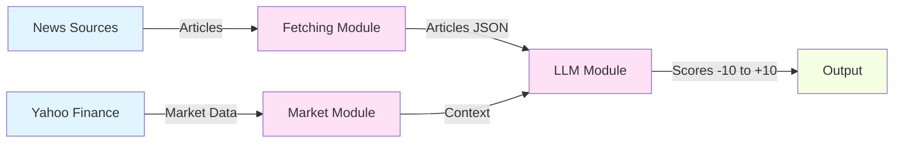

# VUTS - AI Stock News Analyzer

An AI-powered platform for fetching financial news, analyzing sentiment with LLMs, and producing actionable insights on stock outlook.

## 🎯 Overview

VUTS (Value Understanding Through Sentiment) is a complete system that:
- **Fetches** financial news from multiple sources (Google News, Bing News, Finnhub)
- **Analyzes** article sentiment using Large Language Models (OpenAI GPT)
- **Enriches** analysis with historical market data context
- **Scores** news impact from -10.00 (extremely negative) to +10.00 (extremely positive)
- **Organizes** results for easy aggregation and trend analysis

### System Architecture



_See [Architecture Diagrams](docs/Architecture_Diagrams.md) for detailed system visualizations._

## 🚀 Quick Start

### 1. Install Dependencies

```bash
cd scratch
pip install -r requirements.txt
```

### 2. Try the Demos

**Demo 1: Mock Workflow (No API Keys Required)**
```bash
cd scratch
python demos/demo_workflow.py
```

This creates mock data and demonstrates the complete workflow without needing any API keys.

**Demo 2: OpenAI API Demo (Requires OpenAI API Key)**
```bash
cd scratch
export OPENAI_API_KEY="your-openai-api-key"
python demos/demo_openai_api.py
```

This generates articles about AMD, Nvidia, and Broadcom, then analyzes them using the OpenAI API.
Estimated cost: ~$0.01 (less than 2 cents for all articles).

**Demo 3: Recommendation Engine Demo (No API Keys Required) - NEW!**
```bash
cd scratch
python demos/demo_recommendations.py
```

Demonstrates Phase 4 recommendation generation with mock article scores. Shows aggregation, trend analysis, and Buy/Hold/Sell signal generation with full explainability.

### 3. Set Up for Real Data

```bash
# Required for sentiment analysis
export OPENAI_API_KEY="your-openai-api-key"

# Optional for news fetching
export NEWSAPI_KEY="your-newsapi-key"
export BING_NEWS_KEY="your-bing-news-key"
export FINNHUB_KEY="your-finnhub-key"
```

### 4. Run the Complete Workflow

#### Using the Centralized `vuts` Command (Recommended)

```bash
cd scratch

# Fetch news articles
./vuts fetch --config example_data/copilot-gpt5-cfg.json --output-dir output

# Fetch market data (optional but recommended)
./vuts market TSLA MSFT NVIDIA AMD --output-dir output/market_data

# Analyze sentiment with LLM
./vuts analyze --data-dir output --max-articles 10 --market-data-dir output/market_data

# Generate investment recommendations (Phase 4 - NEW!)
python src/scoring/recommendation_engine.py \
    --data-dir output/llm_scores \
    --output-dir output/recommendations

# View results
find output/llm_scores -name "*_score.json" | head -5
cat output/recommendations/TSLA_recommendation.json
```

#### Alternative: Direct Script Calls

```bash
cd scratch

# Fetch news articles
python src/fetching/financial_news_collector_async.py \
    --config example_data/copilot-gpt5-cfg.json --output_dir output

# Fetch market data (optional but recommended)
python src/market/data_fetcher.py TSLA MSFT NVIDIA AMD \
    --output-dir output/market_data

# Analyze sentiment with LLM
python src/llm/sentiment_analyzer.py \
    --data-dir output \
    --max-articles 10 \
    --market-data-dir output/market_data

# Generate investment recommendations (Phase 4 - NEW!)
python src/scoring/recommendation_engine.py \
    --data-dir output/llm_scores \
    --output-dir output/recommendations

# View results
find output/llm_scores -name "*_score.json" | head -5
cat output/recommendations/TSLA_recommendation.json
```

### 5. Launch the Web UI (Recommended)

```bash
cd scratch

# Launch using vuts command (recommended)
./vuts ui

# Or with custom options
./vuts ui --host 0.0.0.0 --port 8080 --debug

# Alternative: Quick launch script
python run_ui.py

# Alternative: Direct script call
python src/ui/app.py --host 0.0.0.0 --port 5000

# Then open your browser to http://localhost:5000
```

The Web UI provides:
- 📊 **Reports Dashboard** - Overview of all topics and sentiment trends
- 📈 **Topics View** - Detailed article analysis at `/reports/topics`
- 🔔 **Notifications** - Real-time alerts with browser notifications and audible alerts
- ⚙️ **Configuration Page** - Manage settings and view workflow commands

## 📚 Documentation

- **[Quick Start Guide](docs/Quick_Start_Guide.md)** - Get up and running in 5 minutes
- **[Complete Workflow Guide](docs/Workflow_Guide.md)** - Detailed usage examples and advanced features
- **[Architecture Diagrams](docs/Architecture_Diagrams.md)** - Visual system diagrams and flow charts
- **[Development Outline](docs/Development_Outline.md)** - Project architecture and future plans
- **[LLM Module](scratch/src/llm/README.md)** - Sentiment analyzer documentation
- **[Scoring Module](scratch/src/scoring/README.md)** - **NEW!** Recommendation engine documentation (Phase 4)
- **[Web UI Module](scratch/src/ui/README.md)** - Web interface documentation
- **[Wiki Pages](wiki/)** - Comprehensive module documentation (ready for GitHub Wiki)

## 📁 Project Structure

```
vuts/
├── docs/                          # Main documentation
│   ├── Quick_Start_Guide.md
│   ├── Workflow_Guide.md
│   └── Development_Outline.md
├── scratch/                       # Main application code
│   ├── vuts                       # Centralized CLI entrypoint
│   ├── src/
│   │   ├── fetching/             # News collection module
│   │   │   └── financial_news_collector_async.py
│   │   ├── llm/                  # LLM sentiment analysis module
│   │   │   ├── sentiment_analyzer.py
│   │   │   ├── sentiment_prompt.txt
│   │   │   └── README.md
│   │   ├── scoring/              # Recommendation engine (Phase 4 - NEW!)
│   │   │   ├── recommendation_engine.py
│   │   │   └── README.md
│   │   ├── market/               # Market data module
│   │   │   └── data_fetcher.py
│   │   ├── ui/                   # Web UI module
│   │   │   ├── app.py            # Flask application
│   │   │   ├── templates/        # HTML templates
│   │   │   ├── static/           # CSS and assets
│   │   │   └── README.md
│   │   ├── tests/                # Test suite
│   │   │   ├── test_llm_analyzer.py
│   │   │   ├── test_scoring_engine.py    # Phase 4 tests (NEW!)
│   │   │   └── test_vuts_entrypoint.py
│   │   └── utils/                # Shared utilities
│   ├── demos/                     # Demo applications
│   │   ├── demo_workflow.py           # Mock workflow demo (no API keys)
│   │   ├── demo_openai_api.py         # OpenAI API demo (requires key)
│   │   └── demo_recommendations.py    # Recommendation engine demo (NEW!)
│   ├── example_data/             # Configuration examples
│   ├── run_ui.py                 # Web UI launcher
│   └── requirements.txt          # Python dependencies
└── chats/                        # Development notes and chat logs
```

## 💻 CLI Usage

The `vuts` command provides a unified interface to all functionality:

```bash
# Get help
./vuts --help
# or
python vuts --help

# Fetch news articles
./vuts fetch --config <config.json> --output-dir <output>

# Analyze sentiment
./vuts analyze --data-dir <data> --max-articles <n> [--market-data-dir <market>]

# Fetch market data
./vuts market <SYMBOL1> <SYMBOL2> ... [--days <n>] [--output-dir <dir>]

# Launch web UI
./vuts ui [--host <host>] [--port <port>] [--debug] [--data-dir <dir>]
```

**Command Details:**

- **fetch**: Collects news articles from multiple sources (Google News, Bing, Finnhub, etc.)
- **analyze**: Performs LLM-powered sentiment analysis on collected articles
- **market**: Fetches historical market data from Yahoo Finance for context
- **ui**: Launches the web interface for viewing sentiment analysis reports

For detailed options, use `./vuts <command> --help`

## 🔑 Key Features

✅ **Centralized CLI** - Single `vuts` command for all operations  
✅ **Multi-Source News Fetching** - Aggregates from Google News RSS, Bing News, Finnhub  
✅ **LLM-Powered Sentiment Analysis** - Uses OpenAI GPT models for accurate scoring  
✅ **Market Context Integration** - Includes historical price data for better analysis  
✅ **Precise Scoring** - Score range from -10.00 to +10.00 with explanations  
✅ **Investment Recommendations** - **NEW!** Buy/Hold/Sell signals with confidence levels (Phase 4)  
✅ **Source Reliability Weighting** - **NEW!** Weights scores based on news source credibility  
✅ **Temporal Decay** - **NEW!** Recent news matters more with exponential time-based decay  
✅ **Trend Analysis** - **NEW!** Detects improving/declining/stable sentiment patterns  
✅ **Full Explainability** - **NEW!** Detailed reasoning and risk factors for recommendations  
✅ **Cost Efficient** - Uses gpt-4o-mini by default (~$0.0006 per article)  
✅ **Web UI** - Browse reports, view sentiment trends, and manage configurations via browser  
✅ **Notification System** - Real-time alerts in UI, browser notifications, and phone subscriptions  
✅ **Smart Caching** - Avoids re-analyzing articles and re-fetching data  
✅ **Async Operations** - Fast parallel processing of multiple sources  
✅ **Test Suite** - Comprehensive tests with no API keys required  

## 📊 Understanding Scores

| Score Range | Meaning | Example |
|------------|---------|---------|
| +7 to +10 | Extremely Positive | Major breakthrough, transformative success |
| +4 to +7 | Very Positive | Beat earnings, upgrades, major wins |
| +2 to +4 | Moderately Positive | Good results, positive developments |
| +0.5 to +2 | Slightly Positive | Minor improvements, optimistic tone |
| -0.5 to +0.5 | Neutral | Balanced reporting, no clear direction |
| -2 to -0.5 | Slightly Negative | Minor concerns, cautious outlook |
| -4 to -2 | Moderately Negative | Concerns, warnings, setbacks |
| -7 to -4 | Very Negative | Missed earnings, downgrades, major losses |
| -10 to -7 | Extremely Negative | Bankruptcy, fraud, catastrophic failure |

## 💼 Investment Recommendations (Phase 4)

The recommendation engine aggregates multiple article scores into actionable Buy/Hold/Sell signals:

| Recommendation | Aggregated Score | Confidence | Meaning |
|---------------|-----------------|------------|---------|
| **STRONG BUY** | ≥ +5.0 | HIGH | Very positive sentiment, strong opportunity |
| **BUY** | +2.5 to +5.0 | MEDIUM-HIGH | Positive sentiment, good entry point |
| **HOLD** | -2.5 to +2.5 | ANY | Neutral sentiment or insufficient data |
| **SELL** | -5.0 to -2.5 | MEDIUM-HIGH | Negative sentiment, consider reducing |
| **STRONG SELL** | ≤ -5.0 | HIGH | Very negative sentiment, high risk |

**Key Factors:**
- **Source Weighting**: Professional APIs (Finnhub) weighted higher than news aggregators
- **Temporal Decay**: Recent articles have more influence (7-day half-life)
- **Trend Analysis**: Improving/declining/stable sentiment detection
- **Confidence Levels**: Based on article count, recency, and consistency
- **Risk Factors**: Automatically identified concerns and caveats

**⚠️ Disclaimer**: Recommendations are based on sentiment analysis, NOT financial advice. Always do your own research and consult financial professionals.

See [Scoring Module Documentation](scratch/src/scoring/README.md) for details.

## 🧪 Running Tests

```bash
cd scratch

# Test LLM analyzer functionality
python src/tests/test_llm_analyzer.py

# Test scoring & recommendation engine (Phase 4 - NEW!)
python src/tests/test_scoring_engine.py

# Test vuts CLI entrypoint
python src/tests/test_vuts_entrypoint.py

# Test notification system
python src/tests/test_notifications.py
```

All tests run without requiring API keys and validate:
- Prompt template loading and formatting
- LLM response parsing
- Temporal decay calculations (Phase 4)
- Score aggregation with weighting (Phase 4)
- Trend analysis and recommendation generation (Phase 4)
- Article discovery and filtering
- Score saving and validation
- CLI entrypoint and subcommand routing
- Notification creation, persistence, and management

## 🔔 Notification System

VUTS includes a comprehensive notification system to alert you about important sentiment changes:

### Features

- **In-App Notifications** - View notifications in the web UI with a notification bell badge
- **Browser Alerts** - Receive audible browser notifications for critical events
- **Phone Subscriptions** - Subscribe phone numbers for SMS/webhook notifications
- **Severity Levels** - info, success, warning, critical with color-coding
- **Auto-Notifications** - Automatic alerts for extreme sentiment scores (±7.0 threshold)

### Quick Start

```bash
cd scratch

# Run the notification demo
python demos/demo_notifications.py

# Start the web UI to see notifications
./vuts ui

# Click the 🔔 bell icon in the navigation bar
```

### API Endpoints

- `GET /api/notifications` - Get all notifications
- `GET /api/notifications/unread` - Get unread notifications
- `POST /api/notifications/<id>/mark-read` - Mark as read
- `POST /api/notifications/mark-all-read` - Mark all as read
- `POST /api/notifications/subscribe` - Subscribe phone number
- `GET /api/notifications/subscriptions` - Get subscriptions

### Phone Subscriptions

```python
# Subscribe to notifications
curl -X POST http://localhost:5000/api/notifications/subscribe \
  -H "Content-Type: application/json" \
  -d '{"phone_number": "+1234567890", "topics": ["TSLA", "MSFT"], "min_severity": "warning"}'
```

See [Notification Module README](scratch/src/notifications/README.md) for detailed documentation.

## 💰 Cost Estimation

Using gpt-4o-mini (recommended):
- Input: $0.150 per 1M tokens
- Output: $0.600 per 1M tokens
- **Cost per article: ~$0.0006** (less than 1/10th of a cent)
- **10 articles: ~$0.006** (about half a cent)

## 🛠️ Technology Stack

- **Language**: Python 3.8+
- **Async I/O**: aiohttp for parallel requests
- **LLM Integration**: OpenAI API (GPT-4o-mini, GPT-4, GPT-3.5-turbo)
- **Market Data**: yfinance (Yahoo Finance)
- **Content Extraction**: BeautifulSoup4, readability-lxml
- **Testing**: Built-in unittest-style tests

## 🔮 Roadmap

See [Development Outline](docs/Development_Outline.md) for detailed plans.

Current focus areas:
- **Phase 2**: News aggregation & storage ✅
- **Phase 3**: AI-powered sentiment analysis ✅
- **Phase 4**: Scoring & recommendation engine ✅
- **Phase 5**: User interface ✅
- **Phase 6**: Notifications & alerts ✅

## 📝 License

This project is currently a research/testing tool. See LICENSE file for details.

## 🤝 Contributing

This is currently a personal project. Feel free to fork and experiment!

## ⚠️ Disclaimer

This tool is for research and educational purposes only. The sentiment scores and analysis should **not** be considered as financial advice. Always do your own research and consult with financial professionals before making investment decisions.

## 📧 Contact

For questions or feedback, please open an issue on GitHub.

---

**Note**: This is a Work In Progress (WIP). The system is functional but may undergo significant changes as development continues.
