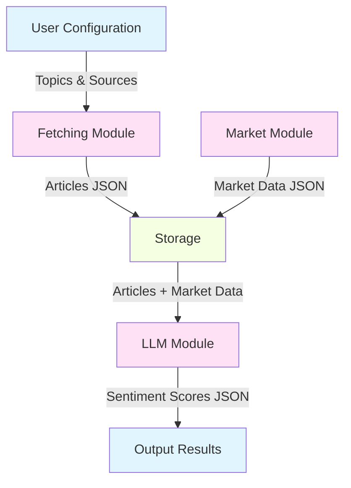
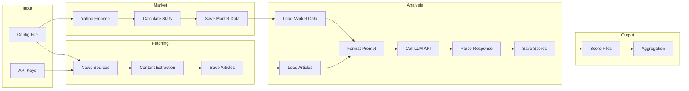
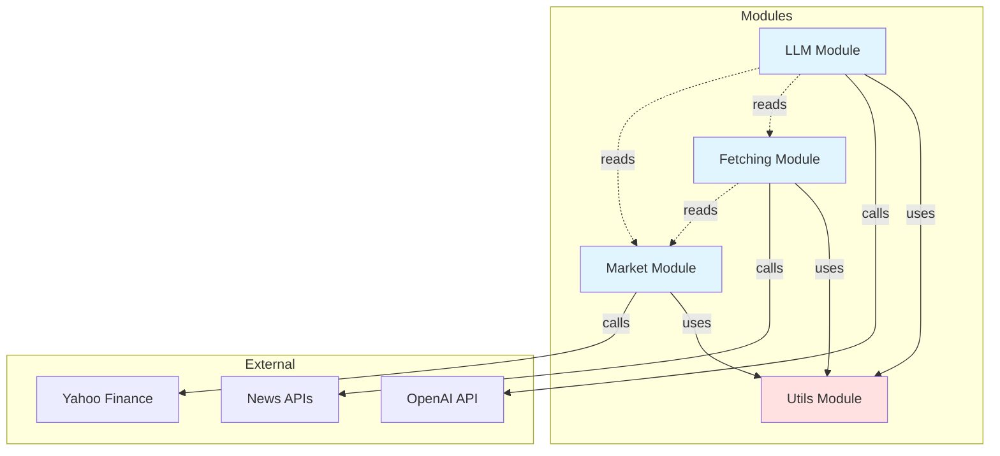
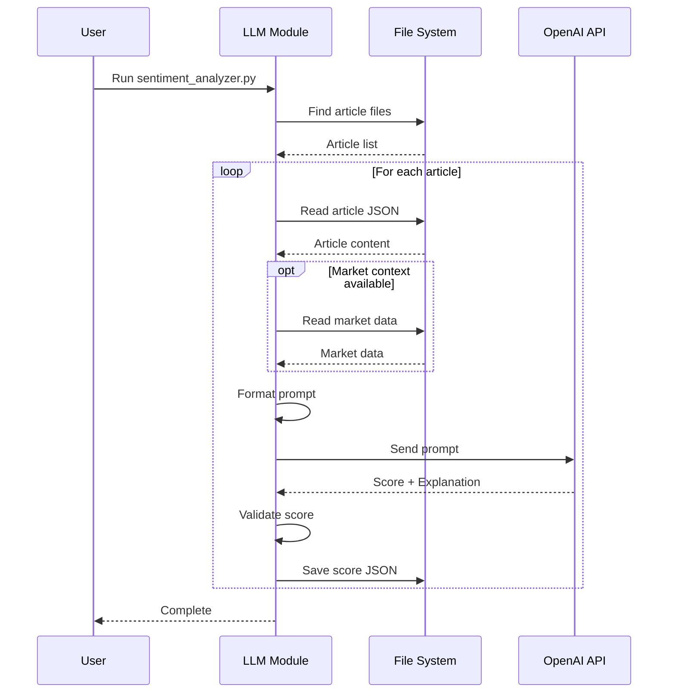
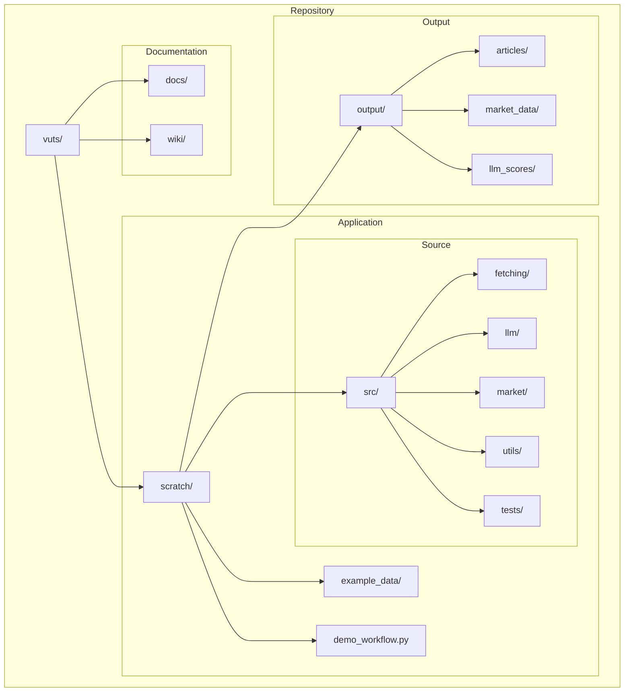
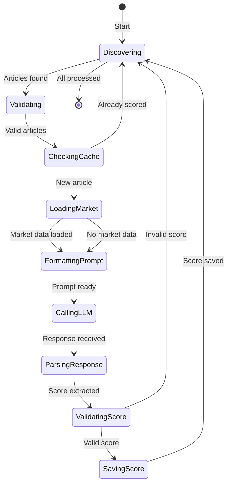
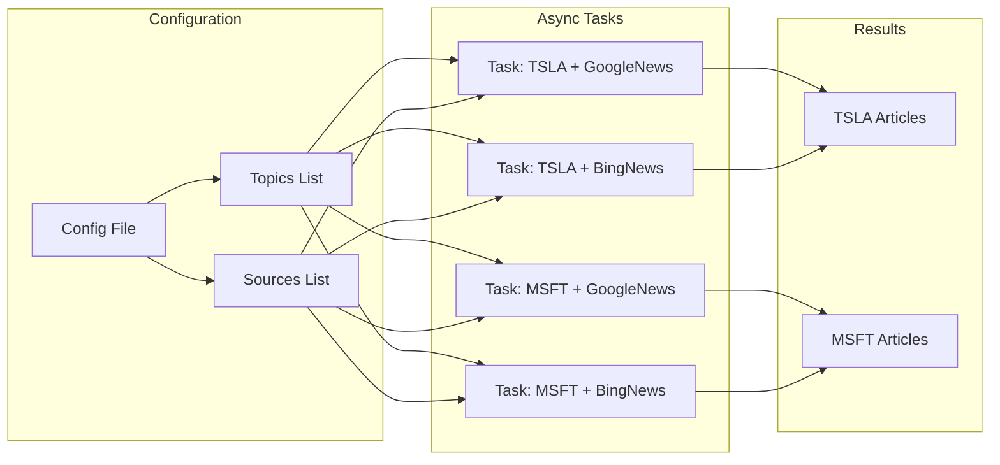
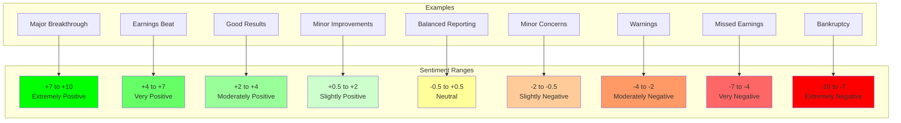
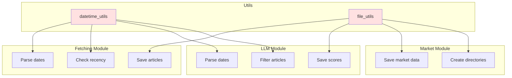

# Architecture Diagrams

Visual diagrams for understanding the VUTS system architecture.

## System Overview

## Data Flow Pipeline

## Module Dependencies

## Sentiment Analysis Workflow

## File Organization

## Score Processing State Machine

## Async Fetching Flow

## Score Distribution Example

## Utility Module Integration

---

## How to Use These Diagrams

These diagrams are written in Mermaid syntax, which renders automatically on GitHub. To view them:

1. **In GitHub**: View this file on GitHub - diagrams render automatically
2. **In VS Code**: Install the "Markdown Preview Mermaid Support" extension
3. **Online**: Copy the code blocks to https://mermaid.live/

## Diagram Types

- **Graph TD/LR**: Top-down or left-right flow charts
- **Flowchart**: Detailed process flows
- **Sequence Diagram**: Interaction between components
- **State Diagram**: State machines and transitions

## Customizing Diagrams

To modify these diagrams:
1. Edit the Mermaid code blocks
2. Test at https://mermaid.live/
3. Update this file with changes
4. Diagrams will render on GitHub automatically
