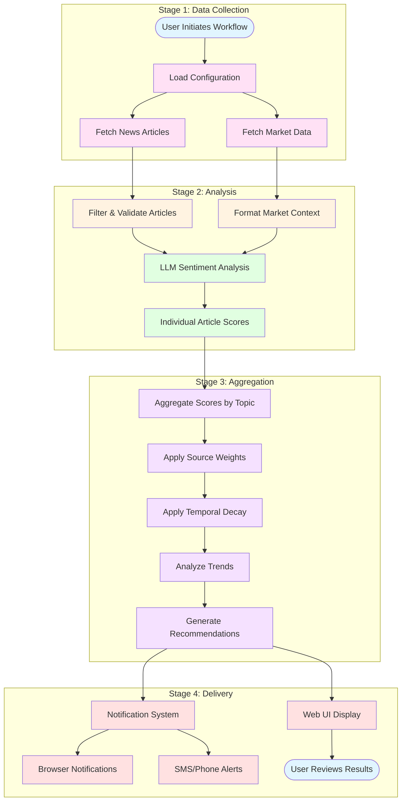
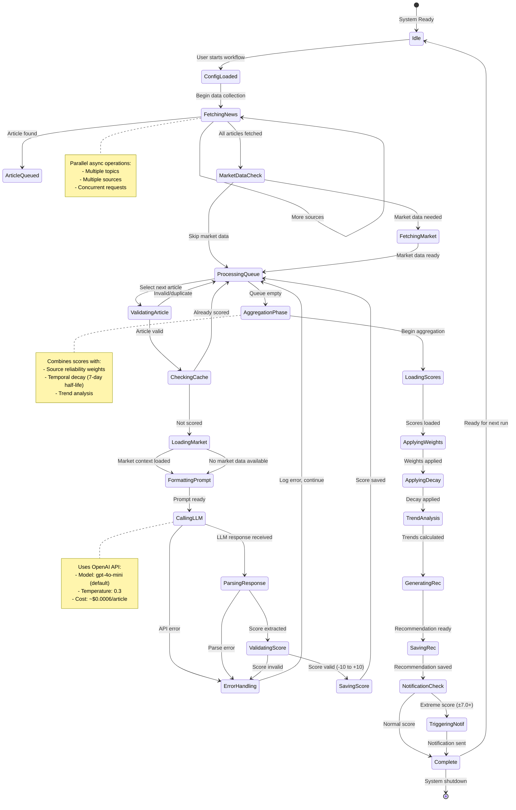
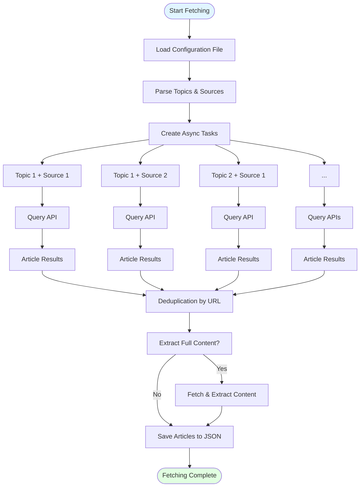
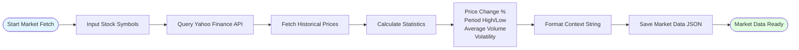
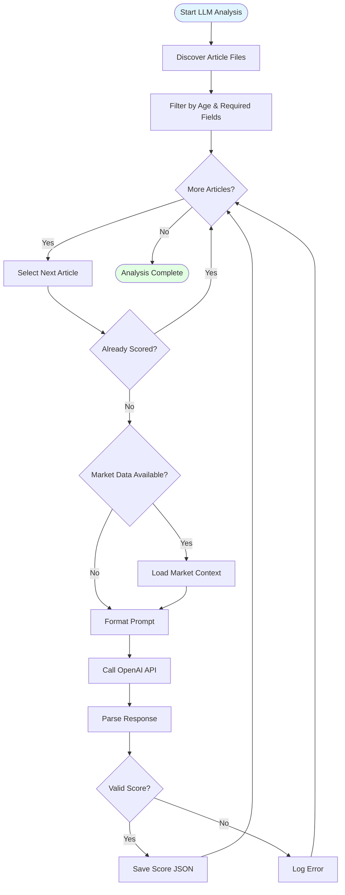
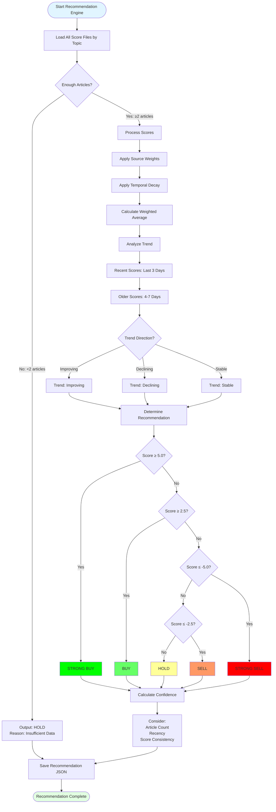
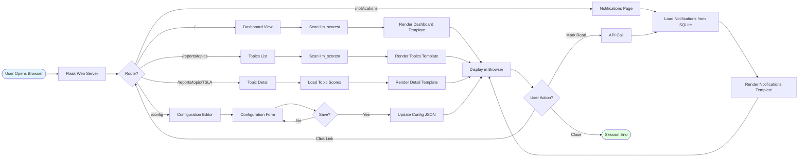
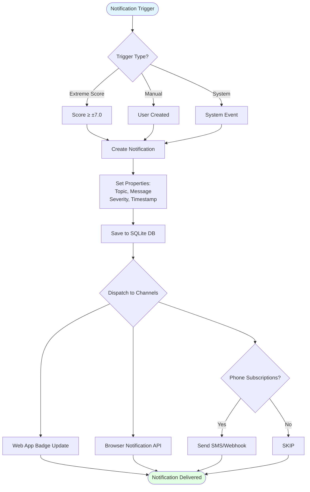
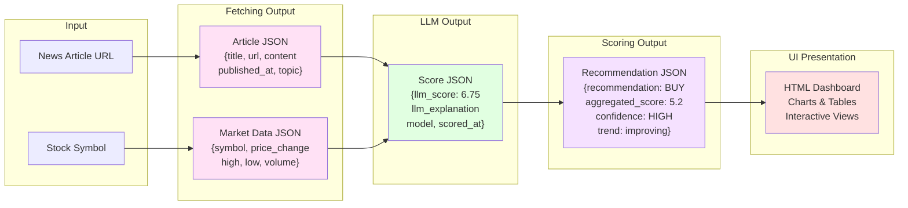
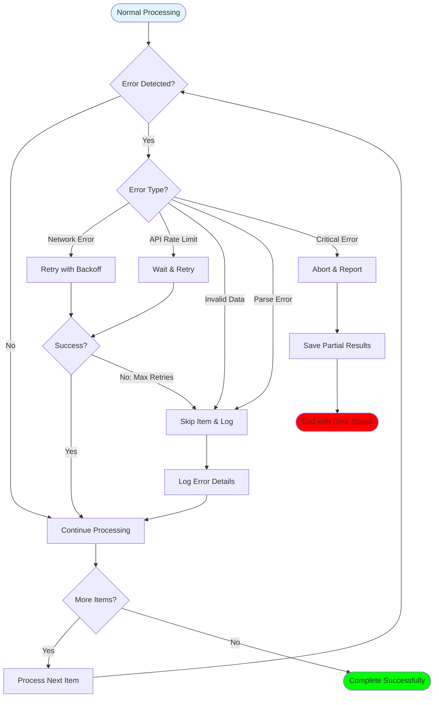

# VUTS System State Flow and Pipeline

This document provides a high-level, visual overview of how VUTS processes financial news from initial fetching through to investment recommendations and user notifications. It includes comprehensive state flow diagrams showing the complete data pipeline and detailed explanations of each component.

## 📋 Table of Contents

- [Complete System Pipeline](#complete-system-pipeline)
- [State Flow Diagram](#state-flow-diagram)
- [Module-by-Module Workflow](#module-by-module-workflow)
- [Data Transformation Flow](#data-transformation-flow)
- [Error Handling and Recovery](#error-handling-and-recovery)
- [Related Documentation](#related-documentation)

---

## Complete System Pipeline

The VUTS system follows a clear, linear pipeline from data collection through analysis to actionable recommendations:



### Pipeline Component Descriptions

**Stage 1: Data Collection**
- **Load Configuration**: Reads user settings including target topics (e.g., TSLA, MSFT), news sources to query, and time ranges
- **Fetch News Articles**: Asynchronously queries multiple news APIs (Google News RSS, Bing News, Finnhub) for recent financial articles
- **Fetch Market Data**: Retrieves historical stock prices, volume, and trading statistics from Yahoo Finance for context

**Stage 2: Analysis**
- **Filter & Validate Articles**: Removes duplicates, validates required fields, and filters by age and relevance
- **Format Market Context**: Transforms raw market data into structured context (price changes, trends, volatility) for the LLM
- **LLM Sentiment Analysis**: Sends each article to OpenAI's GPT models with market context to generate sentiment scores (-10.00 to +10.00)
- **Individual Article Scores**: Stores scored articles with explanations for transparency

**Stage 3: Aggregation**
- **Aggregate Scores**: Combines multiple article scores for each stock symbol
- **Apply Source Weights**: Weights scores based on source reliability (e.g., Finnhub 1.0, Bing 0.9, Google RSS 0.85)
- **Apply Temporal Decay**: Recent articles receive higher weights (7-day half-life exponential decay)
- **Analyze Trends**: Detects if sentiment is improving, declining, or stable over time
- **Generate Recommendations**: Produces actionable Buy/Hold/Sell signals with confidence levels

**Stage 4: Delivery**
- **Web UI Display**: Shows interactive dashboard with sentiment trends, article details, and recommendations
- **Notification System**: Triggers alerts for significant sentiment shifts or extreme scores
- **Browser Notifications**: In-app alerts with audible notifications
- **SMS/Phone Alerts**: Sends notifications to subscribed phone numbers for critical events
- **User Reviews Results**: Users examine recommendations and make informed investment decisions

---

## State Flow Diagram

This diagram shows the complete state machine for processing a single article through the VUTS system:



### State Descriptions

**Idle**: System is ready to process new data. Waiting for user to initiate a workflow run.

**ConfigLoaded**: Configuration file has been read and validated. System knows which topics to analyze and which sources to query.

**FetchingNews**: Actively querying news APIs asynchronously. Multiple concurrent requests are made to different sources (Google News, Bing, Finnhub). Articles are deduplicated by URL to prevent processing the same content twice.

**ArticleQueued**: A valid article has been retrieved and queued for processing. The article includes title, URL, publication date, and optionally full content.

**MarketDataCheck**: System determines if market data should be fetched. This provides context like recent price changes and volatility that helps the LLM produce more informed sentiment scores.

**FetchingMarket**: Querying Yahoo Finance for historical stock data (typically 30 days). Calculates statistics like price change percentage, period high/low, and average volume.

**ProcessingQueue**: Iterating through queued articles sequentially. Each article goes through validation, caching checks, and sentiment analysis.

**ValidatingArticle**: Checking article has required fields (title, content, date, topic). Ensures content is not empty and publication date is recent enough.

**CheckingCache**: Looking for existing score file to avoid re-analyzing the same article. This saves API costs and processing time.

**LoadingMarket**: Loading previously fetched market data for the article's topic. Formats it into a context string that will be prepended to the LLM prompt.

**FormattingPrompt**: Constructing the complete prompt by combining the template, article content, and market context. The prompt instructs the LLM to provide a score (-10.00 to +10.00) and explanation.

**CallingLLM**: Sending the formatted prompt to OpenAI's API. Using temperature 0.3 for consistent, deterministic results. The gpt-4o-mini model provides excellent quality at low cost.

**ParsingResponse**: Extracting the score and explanation from the LLM's response. Looks for "SCORE: X.XX" pattern and captures the explanation text.

**ValidatingScore**: Ensuring the extracted score is a valid number within the -10.00 to +10.00 range. Invalid scores trigger error handling.

**SavingScore**: Writing the score, explanation, article metadata, and timestamp to a JSON file in the `llm_scores/` directory, organized by topic.

**ErrorHandling**: Logging errors (API failures, parse errors, invalid scores) and continuing to process remaining articles. The system is designed to be resilient to individual failures.

**AggregationPhase**: Beginning the recommendation generation phase. All individual article scores have been collected.

**LoadingScores**: Reading all score JSON files for each topic from the `llm_scores/` directory.

**ApplyingWeights**: Multiplying each score by its source's reliability weight. For example, Finnhub scores (weight 1.0) are trusted more than Google News RSS (weight 0.85).

**ApplyingDecay**: Applying exponential temporal decay to older articles. Articles lose 50% of their weight after 7 days. Articles older than 30 days are excluded entirely.

**TrendAnalysis**: Comparing recent scores (last 3 days) with older scores (4-7 days) to detect if sentiment is improving, declining, or stable.

**GeneratingRec**: Determining Buy/Hold/Sell recommendation based on the weighted average score. Thresholds: Strong Buy ≥5.0, Buy ≥2.5, Hold -2.5 to 2.5, Sell ≤-2.5, Strong Sell ≤-5.0.

**SavingRec**: Writing the recommendation with confidence level, aggregated score, trend analysis, article count, and detailed explanation to a JSON file.

**NotificationCheck**: Evaluating if the recommendation meets criteria for triggering user notifications (e.g., extreme scores ±7.0 or higher).

**TriggeringNotif**: Creating and sending notifications through available channels (in-app UI alerts, browser notifications, SMS to subscribed phones).

**Complete**: Processing cycle finished. Results are ready for viewing in the Web UI.

---

## Module-by-Module Workflow

### 1. Fetching Module Workflow



**How it works:**
1. **Configuration Loading**: Reads JSON config specifying topics (stock symbols) and sources (news APIs)
2. **Task Creation**: Creates one async task for each topic-source combination (e.g., TSLA+GoogleNews, TSLA+Bing)
3. **Parallel Querying**: All tasks run concurrently, maximizing speed through async I/O
4. **Deduplication**: Removes duplicate articles based on URL to avoid processing the same content multiple times
5. **Content Extraction**: Optionally fetches full article text from URLs (top N articles per topic)
6. **Storage**: Saves articles as JSON files in structured directories: `output/{source}/{topic}/`

### 2. Market Module Workflow



**How it works:**
1. **Symbol Input**: Receives list of stock symbols to fetch (e.g., TSLA, MSFT, NVIDIA)
2. **Historical Data**: Queries Yahoo Finance for daily OHLCV data (typically 30 days)
3. **Statistics Calculation**: Computes price change percentage, period high/low, average volume, and volatility
4. **Context Formatting**: Transforms statistics into human-readable text for the LLM (e.g., "TSLA is up 10.5% over the past 30 days")
5. **Storage**: Saves market data as JSON: `output/market_data/{SYMBOL}_market_data.json`

### 3. LLM Module Workflow



**How it works:**
1. **Article Discovery**: Recursively scans data directory for article JSON files
2. **Filtering**: Removes articles that are too old or missing required fields
3. **Cache Check**: Skips articles that have already been scored (saves API costs)
4. **Market Context**: If available, loads and prepends market data context to the prompt
5. **Prompt Formatting**: Combines template + article content + market context into final prompt
6. **LLM Call**: Sends prompt to OpenAI API (gpt-4o-mini by default) with temperature 0.3
7. **Response Parsing**: Extracts score (e.g., "SCORE: +6.75") and explanation text
8. **Validation**: Ensures score is numeric and within [-10.00, +10.00] range
9. **Storage**: Saves score, explanation, and metadata to `output/llm_scores/{topic}/`

### 4. Scoring Module Workflow



**How it works:**
1. **Load Scores**: Reads all score JSON files for a given topic from `llm_scores/` directory
2. **Minimum Check**: Requires at least 2 articles for a recommendation; otherwise outputs HOLD with "insufficient data" reason
3. **Source Weighting**: Multiplies each score by source reliability weight (Finnhub 1.0, Bing 0.9, Google RSS 0.85)
4. **Temporal Decay**: Applies exponential decay based on article age (7-day half-life, 30-day cutoff)
5. **Weighted Average**: Calculates final aggregated score considering both weights and decay
6. **Trend Analysis**: Compares recent scores (last 3 days) with older scores (4-7 days) to detect sentiment direction
7. **Recommendation Logic**: Maps score to recommendation:
   - Score ≥ 5.0 → STRONG BUY
   - Score ≥ 2.5 → BUY
   - -2.5 < Score < 2.5 → HOLD
   - Score ≤ -2.5 → SELL
   - Score ≤ -5.0 → STRONG SELL
8. **Confidence Calculation**: Determines HIGH/MEDIUM/LOW confidence based on article count, recency, and score consistency
9. **Risk Factors**: Identifies potential concerns (low article count, conflicting scores, extreme volatility)
10. **Storage**: Saves recommendation with full explainability to `output/recommendations/{TOPIC}_recommendation.json`

### 5. UI Module Workflow



**How it works:**
1. **Flask Server**: Web framework serves HTML pages and API endpoints
2. **Route Handling**: Different URLs map to different views (dashboard, topics, notifications)
3. **Data Loading**: Scans file system for score JSONs and loads recommendation data
4. **Template Rendering**: Uses Jinja2 templates to generate HTML with dynamic data
5. **Interactive Features**: JavaScript handles browser notifications, mark-as-read actions, and real-time updates
6. **Configuration Editor**: Allows editing workflow settings through web interface
7. **API Endpoints**: RESTful APIs for notifications management (`/api/notifications/*`)

### 6. Notification Module Workflow



**How it works:**
1. **Trigger Detection**: Automatically triggers for extreme sentiment scores (±7.0 or higher)
2. **Notification Creation**: Generates notification with topic, message, severity (info/success/warning/critical), and timestamp
3. **Persistence**: Saves to SQLite database for history and unread tracking
4. **Multi-Channel Dispatch**:
   - **Web App**: Updates notification badge count in UI navigation
   - **Browser**: Uses browser Notification API for desktop/mobile alerts with sound
   - **SMS**: Sends to subscribed phone numbers if configured
5. **User Management**: Users can mark as read, dismiss, or manage phone subscriptions

---

## Data Transformation Flow

This section shows how data transforms as it moves through the system:



### Data Format Examples

**1. Article JSON** (`output/googlenews_rss/TSLA/001_2024-11-22.json`)
```json
{
  "source": "googlenews_rss",
  "topic": "TSLA",
  "title": "Tesla Reports Record Q4 Deliveries",
  "url": "https://example.com/article",
  "published_at": "2024-11-22T10:30:00+00:00",
  "content": "Full article text...",
  "score": 0.85
}
```

**2. Market Data JSON** (`output/market_data/TSLA_market_data.json`)
```json
{
  "symbol": "TSLA",
  "company_name": "Tesla, Inc.",
  "latest_price": 242.50,
  "price_change_percent": 10.86,
  "period_high": 248.30,
  "period_low": 215.20,
  "average_volume": 120000000,
  "data_period_days": 30,
  "fetched_at": "2024-11-22T12:00:00+00:00"
}
```

**3. Score JSON** (`output/llm_scores/TSLA/001_2024-11-22_score.json`)
```json
{
  "article_file": "output/googlenews_rss/TSLA/001_2024-11-22.json",
  "topic": "TSLA",
  "title": "Tesla Reports Record Q4 Deliveries",
  "llm_score": 6.75,
  "llm_explanation": "Extremely positive sentiment due to record deliveries exceeding expectations...",
  "model": "gpt-4o-mini",
  "scored_at": "2024-11-22T14:30:00+00:00",
  "market_context_used": true
}
```

**4. Recommendation JSON** (`output/recommendations/TSLA_recommendation.json`)
```json
{
  "topic": "TSLA",
  "recommendation": "BUY",
  "aggregated_score": 5.25,
  "confidence": "HIGH",
  "num_articles": 8,
  "trend": "improving",
  "reasoning": "Strong positive sentiment across 8 recent articles with improving trend...",
  "risk_factors": [],
  "generated_at": "2024-11-22T15:00:00+00:00"
}
```

---

## Error Handling and Recovery

VUTS is designed to be resilient to failures at any stage:



### Error Handling Strategies

**Network Errors**: Temporary network failures (timeouts, connection refused) trigger exponential backoff retry (3 attempts with 2x, 4x, 8x delays).

**API Rate Limits**: When hitting OpenAI or news API rate limits, the system waits for the specified retry-after period before continuing.

**Invalid Data**: Articles with missing required fields or scores outside the valid range are skipped and logged. Processing continues with remaining items.

**Parse Errors**: If LLM response cannot be parsed (malformed output), the article is skipped and an error is logged. The system does not halt.

**Critical Errors**: Fatal errors (configuration file not found, API key invalid) cause graceful shutdown with error reporting and saving of any partial results.

### Graceful Degradation

- **No Market Data**: If market data fetching fails, LLM analysis continues without market context
- **Partial Scores**: Recommendations can be generated even if some articles failed to score
- **Insufficient Data**: Topics with <2 articles receive "HOLD" recommendation with "insufficient data" explanation
- **API Unavailable**: System can operate in demo mode with mock data for testing

---

## Related Documentation

This document provides the high-level overview. For deeper dives into specific areas:

### Technical Documentation
- **[Architecture Diagrams](Architecture_Diagrams.md)** - Detailed Mermaid diagrams of system components
- **[Development Outline](Development_Outline.md)** - Complete project phases and feature roadmap
- **[Technical Setup Guide](Technical_Setup_Guide.md)** - Developer environment setup and configuration

### Usage Guides
- **[Quick Start Guide](Quick_Start_Guide.md)** - Get running in 5 minutes
- **[Workflow Guide](Workflow_Guide.md)** - Complete workflow with examples for all phases
- **[Hands-On Tutorial](Tutorial_Hands_On.md)** - Interactive tutorial for new users

### Module Documentation
- **[Fetching Module README](../scratch/src/fetching/README.md)** - News collection implementation details
- **[LLM Module README](../scratch/src/llm/README.md)** - Sentiment analysis and prompt engineering
- **[Scoring Module README](../scratch/src/scoring/README.md)** - Recommendation engine algorithms
- **[UI Module README](../scratch/src/ui/README.md)** - Web interface features and API
- **[Notifications Module README](../scratch/src/notifications/README.md)** - Alert system and subscriptions

### Wiki Pages
- **[Wiki Home](../wiki/Home.md)** - Wiki navigation and overview
- **[Getting Started](../wiki/Getting-Started.md)** - Setup instructions
- **[Architecture](../wiki/Architecture.md)** - System architecture overview

---

## Summary

VUTS processes financial news through six distinct stages:

1. **Data Collection** - Fetches news and market data from multiple sources
2. **Validation** - Filters, deduplicates, and validates data quality
3. **Analysis** - Uses LLM to score sentiment with market context
4. **Aggregation** - Combines scores with weighting and temporal decay
5. **Recommendation** - Generates actionable Buy/Hold/Sell signals
6. **Delivery** - Presents results through UI and sends notifications

The system is designed for reliability, cost-efficiency, and transparency. Every score includes an explanation, every recommendation includes reasoning, and the entire pipeline is observable through logs and the Web UI.

For hands-on experience, try the demos:
```bash
cd scratch

# Complete mock workflow (no API keys needed)
python demos/demo_workflow.py

# Real OpenAI API analysis
export OPENAI_API_KEY="your-key"
python demos/demo_openai_api.py

# Recommendation engine demo
python demos/demo_recommendations.py
```
